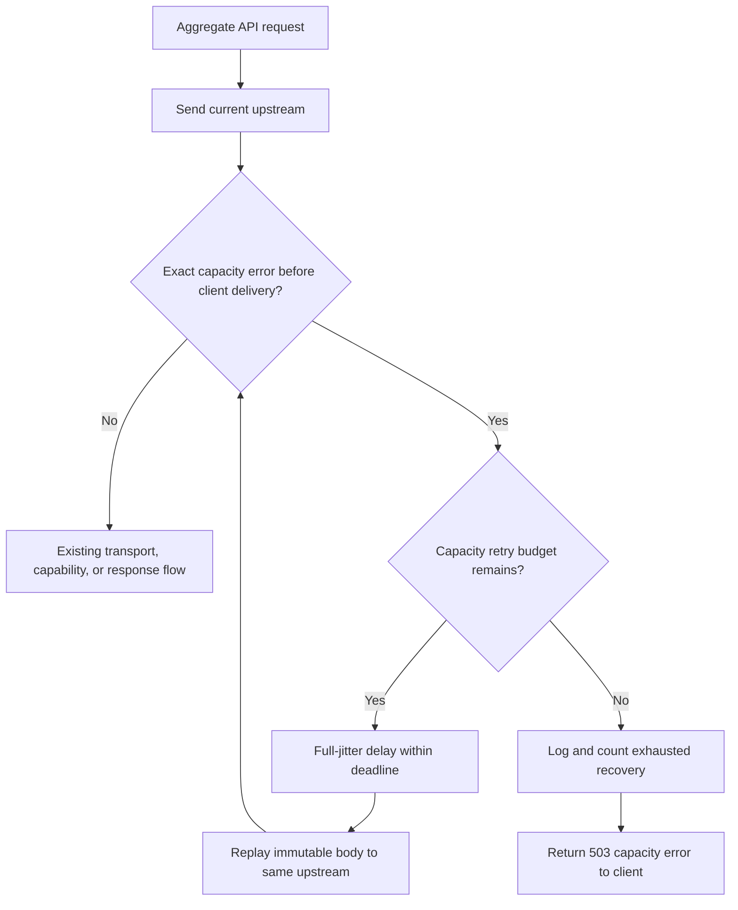

# 上游 API 容量错误自动恢复设计

## Architecture

改动仅限 Aggregate API 网关路径：`crates/service/src/gateway/upstream/protocol/aggregate_api.rs`。不改变 Codex 客户端、账号池候选执行器或模型路由。

容量错误的统一分类继续使用 `crate::gateway::is_selected_model_capacity_error`。它保持现有的窄匹配规则，防止把泛化的供应商故障当作可安全重放的容量事件。

## Retry Policy

| Property | Decision |
| --- | --- |
| Scope | Current Aggregate API candidate only |
| Total attempts | 3: initial request + 2 capacity replays |
| Backoff | Existing `sleep_with_exponential_jitter`; base 500 ms, per-wait cap 1 s, therefore maximum additional wait is 1.5 s, below the approved approximately 2 s limit |
| Deadline | `request_deadline` remains authoritative; a wait that cannot fit is terminal timeout behavior |
| Candidate change | Forbidden for capacity errors, even when other candidates exist |
| Model change | Forbidden |
| Error match | Existing exact classifier only |
| Terminal result | HTTP 503 with the normalized original capacity message and trace ID |

The capacity branch must short-circuit before the existing `transport_retry_budget_remaining` handling. Otherwise a capacity error consumes both budgets and violates the three-attempt policy.

## Data Flow

### HTTP non-success response

1. `builder.send()` returns a non-success response and the gateway reads its error body.
2. The exact capacity classifier matches the message before the client request is consumed.
3. If one of two capacity retries remains, record the event, sleep with jitter, and rebuild the request from `original_candidate_body` / the candidate-local immutable rewrite pipeline.
4. If exhausted, set a terminal capacity outcome, retain the message, bypass cooldown and candidate failover, and respond with `respond_error(..., 503, ...)`.

### HTTP 200 carrying an SSE capacity error

1. `respond_with_upstream` detects the error before it writes a deliverable client event and returns `pending_failover_request`.
2. The capacity branch uses that returned request for the same two-retry policy.
3. On exhaustion it must consume `pending_failover_request` to write the 503 response directly. It must not mark the candidate successful or fall through to the outer candidate loop; doing either can silently close the client request.

### Already-delivered stream

If `pending_failover_request` is absent, client-visible output has started. The gateway must not replay; existing stream delivery remains authoritative. This preserves at-most-once visible text/tool effects.

## Error and Health Semantics

- Capacity errors do not call `gateway_record_aggregate_api_failure` and do not create cooldown entries.
- They do not increment ordinary gateway failover counters because no alternate candidate is attempted.
- The original upstream error message is returned without secrets or request body data. The response uses status `503`, resulting in the existing `server_error` envelope.
- Existing 429, 5xx transport errors, capability fallbacks, reasoning guard recovery and non-capacity terminal errors retain their existing policies.

## Observability

Retain `codexmanager_gateway_upstream_capacity_internal_retries_total` and add counters for capacity detections and exhausted recovery. Emit structured events for detection, scheduled retry and exhausted recovery with: `trace_id`, `aggregate_api_id`, supplier name when present, upstream model, stream flag, attempt number, planned delay and final status. Do not emit secrets, authorization values or body content.

## Compatibility and Rollback

- No schema migration, settings API or frontend change is required. Policy constants remain service-local for this focused fix.
- The change preserves the existing error classifier and response envelope.
- Rollback is a single service-code revert; no persisted state needs reversal.

## Test Strategy

Add deterministic tests around a local mock upstream and direct helper tests where available:

1. HTTP capacity error then success: exactly two upstream attempts, no client-visible first error.
2. Two capacity errors then success: exactly three upstream attempts.
3. Three capacity errors: exactly three upstream attempts, terminal 503 with original message, no next candidate attempt and no cooldown.
4. A capacity error does not consume the generic transport retry budget.
5. HTTP 200 SSE capacity error then success: same retry policy and no leaked error frame.
6. HTTP 200 SSE capacity error exhausted: explicit 503 terminal response, not a silent disconnect.
7. A stream after visible output is not replayed.
8. Near-expired request deadline does not sleep past its deadline.
9. Exact-match positives retain compatibility; non-matching capacity-like messages do not enter the policy.
10. Metrics and structured event fields reflect detection, retries and exhaustion without sensitive fields.
