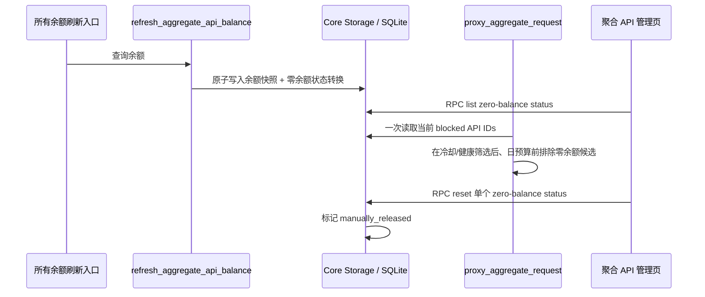

# 技术设计：聚合 API 零余额路由禁用

## 目标与边界

为每个具备余额查询能力的聚合 API 增加一个**独立、可持久化的零余额路由状态**。一次成功、有效且 `remaining == 0` 的刷新会临时排除该 API；成功、有效且 `remaining > 0` 的刷新会恢复它；失败、缺值、无效或负余额都不创建、不清除既有状态。管理员可单独解除该状态，且解除在服务重启后仍有效，直到下一次成功的零余额刷新重新触发。

本设计不改变 `AggregateApi.status`、模型路由、失败冷却、健康监测、日消费额限制或余额供应商适配器。

## 已确认的设计决策

1. **状态独立且持久化。** 新增 SQLite 表，而不是复用 `aggregate_apis.last_balance_*`、失败冷却、health state 或 `policy_action`。这保证重启不会放行已知零余额的上游，且管理员解除不会误清其他路由状态。
2. **刷新事件是唯一判定入口。** `refresh_aggregate_api_balance` 同时被单项 RPC、配额批量刷新和后台轮询调用；只有这里根据新的 typed snapshot 更新零余额状态。候选路由不反向解析旧的 `last_balance_json`，因此手动解除不会被一份尚未刷新的零余额缓存立即覆盖。
3. **精确零值才阻断。** 仅成功、有效、有限且 `remaining == 0` 写入阻断。成功正余额删除状态；失败、缺值、无效和负值保持现有状态。负值不被擅自扩展为“零余额”。
4. **未知结果 fail-open，但不遗忘已确认状态。** 没有余额查询能力的 API 始终不参与；查询失败不能产生阻断，同时不会撤销已经证实的零余额阻断。无 TTL；恢复由成功正余额或管理员明确解除驱动。
5. **手动解除必须可解释。** 状态表保留 `manually_released`，而非简单删除记录。UI 因而能在“余额仍显示 0”时说明这是管理员手动放行；下一次有效零余额刷新把状态重新切为阻断。
6. **跨端 RPC 沿用现有管理链。** 新方法通过 Rust RPC dispatch、Tauri command registry、Web command map 和 `accountClient` 暴露；accounts 模式仍只允许 admin/system_admin，且浏览器永不持有内部 RPC token 或余额凭据。

## 持久化模型

新增迁移 `crates/core/migrations/132_aggregate_api_zero_balance_route_state.sql`（实施时先重新确认下一个未占用迁移号；当前最高为 `131`）。创建每个聚合 API 一条的状态表，并以 `ON DELETE CASCADE` 关联 `aggregate_apis`：

| 字段 | 用途 |
| --- | --- |
| `aggregate_api_id` | 主键；状态按 API source，而非模型粒度。 |
| `state` | `zero_balance_blocked` 或 `manually_released`。 |
| `observed_at` | 触发该状态的最后一次成功零余额查询时间。 |
| `released_at` | 管理员手动解除时间；仅手动放行时存在。 |
| `updated_at` | 最后一次状态转换时间。 |

状态转换由 Core storage 在与 `last_balance_*` 写入相同的 SQLite transaction 内完成：

| 刷新结果 / 管理操作 | 缓存余额结果 | 路由状态 |
| --- | --- | --- |
| 有效且 `remaining == 0` | 保存成功快照 | upsert `zero_balance_blocked`，清空 `released_at`。 |
| 有效且 `remaining > 0` | 保存成功快照 | 删除状态行。 |
| 查询失败、无效、无余额值、负值 | 保持现有失败/缓存语义 | 不改变状态行。 |
| 将 `balance_query_enabled` 设为 `false` | 保持既有配置更新语义 | 在同一配置更新 transaction 删除状态行；该 API 不再参与余额规则。 |
| 管理员解除 | 不改 `last_balance_*` | 转为 `manually_released`，保留最近零余额观察时间。 |
| 删除 API | 现有删除流程 | 外键级联删除状态。 |

如果余额缓存和路由状态的原子写入失败，刷新不得将本次成功伪报为已持久化成功，也不得改变路由状态；记录服务端错误并沿用现有刷新失败反馈。该事务边界避免“页面显示新余额但候选规则仍是旧状态”的分裂。
提交 transaction 必须先确认父 `aggregate_apis` 行仍存在，且余额 cache `UPDATE` 恰好影响一行；否则将并发删除视为刷新失败，不得报告成功。状态转换还必须以**提交时** `balance_query_enabled == true` 为前置：网络请求在配置被关闭后才返回时，可保持既有余额缓存更新语义，但不得重建零余额路由状态。关闭余额查询与删除状态必须在同一配置 transaction 中完成，以避免晚到的零余额结果重新阻断无查询能力的 API。

## 余额错误脱敏边界

现有 `read_json_response` 会把非成功响应 body 拼入错误，随后由 `refresh_aggregate_api_balance` 写入 `last_balance_error`、返回 refresh RPC，并经 `AggregateApiSummary` 暴露给浏览器。这与本任务的敏感信息边界不兼容，必须在错误产生处修正：

- 非成功 HTTP 响应只保留稳定的 `balance_query_http_status` 分类和数值状态码；丢弃 response body。
- 有效 HTTP 响应内的 `message`、`error`、`status` 等仅用于内部判定 `is_valid`，持久化/返回的 `invalidMessage` 必须转换为固定、安全的分类，不能保留上游原文。
- `last_balance_error`、refresh result message、batch log、RPC、request log 和 UI toast 只消费该安全分类；API secret、balance token、鉴权 header、账户标识和上游原始 body 不得跨越服务边界或入库。
- 将此清理与零余额 state transaction 一起测试：即使上游在错误 body 或 invalid 字段中回显凭据，数据库、RPC payload、请求日志和桌面/Web UI 仍不得包含该值。

## 数据流与候选筛选

> 此图说明预期边界，供评审使用；不是实现代码规范。



`crates/service/src/gateway/upstream/protocol/aggregate_api.rs::proxy_aggregate_request` 维持现有“最终发请求前过滤候选”的位置与排序。它会一次读取所有 `zero_balance_blocked` API ID，并在原有失败冷却/health 筛选结果之外单独记录零余额跳过原因：

- 某个候选被零余额排除时，不发送上游请求，也不把原因记录成冷却；仅写安全的结构化服务日志。
- 零余额筛选放在既有 cooldown/health 短路之后、日预算筛选之前：冷却/health 已筛空时保留既有 503，剩余候选全被零余额筛空时才返回明确的零余额 503，随后日预算筛空时保留既有 429。混合原因不新增全池逐候选归因或伪造 `attempted_aggregate_api_ids`；任何零余额日志均不得标为 cooldown。
- 管理员解除只移除零余额门；API 仍可能因人工 disabled、模型 route、失败冷却、health 或日预算而不成为候选。

不复用 `gateway_is_aggregate_api_in_cooldown`，也不写 `policy_action`：前者的名称与 API 对外语义都是失败冷却，后者每个 Aggregate API 只有单一 `cooldown` action key，会覆盖失败冷却的可观察性。

## 服务 RPC 契约

新增独立的管理员管理能力：

| RPC | 输入 | 输出 | 语义 |
| --- | --- | --- | --- |
| `aggregateApi/zeroBalanceStatus/list` | 无 | `{ items: AggregateApiZeroBalanceStatus[] }` | 返回 blocked 与 manually released 状态，供 UI 合并配置列表。 |
| `aggregateApi/zeroBalanceStatus/reset` | `{ id }` | 单个 `AggregateApiZeroBalanceStatus` | 验证 API 存在后，仅将现有 `zero_balance_blocked` 状态转为 `manually_released`；从未进入此状态或已被放行时幂等返回且不创建虚假的放行记录；不触碰余额快照、失败冷却、health 或配置启停。 |

`AggregateApiZeroBalanceStatus` 仅包含 `aggregateApiId`、状态、最近观察时间、手动解除时间和更新时间。不要返回 API secret、余额查询 token、上游原始响应、完整错误或请求体。

命令链必须完整同步：

```text
service aggregate API function
  -> rpc_dispatch::aggregate_api
  -> apps/src-tauri command + registry
  -> apps/src/lib/api/transport-web-commands
  -> accountClient + normalizer + TypeScript type
  -> React Query hook / 管理页面
```

新方法不加入 `MEMBER_METHOD_ALLOWLIST`；它继承现有 `/api/rpc` Web session、内部 RPC token、同源/loopback 校验和 accounts-mode admin gate。

## UI 行为

在现有聚合 API 表的“运行状态”单元格中组合显示独立状态，而不是覆盖现有冷却或健康单元格：

- `zero_balance_blocked`：显示“余额为 0 · 已临时排除”和“解除余额禁用”按钮；Tooltip 显示最近成功零余额查询时间，不显示上游原始响应。
- `manually_released`：显示“余额为 0 · 已手动放行”；此状态没有重复的解除按钮，但明确表明下一次成功零余额刷新会再次阻断。
- 失败冷却仍显示原有模型粒度倒计时及“解除冷却”；若两者同时存在，两个原因与两个操作均可见，且操作只作用于自身状态。
- 余额刷新 mutation 完成后同时失效 `aggregate-apis` 和新的零余额状态 query；手动解除只失效新的 query。
- 新增确认对话框、成功/失败 toast 和三套既有聚合 API i18n message section（en/ko/ru）。不能复用“冷却”文案。
- 运行状态必须以文本说明原因，颜色只作辅助；解除按钮使用文字可访问名称、至少 24×24 CSS px 的可点击区域和现有可见焦点样式。确认框沿用组件的焦点约束、Escape/取消退出与触发按钮焦点恢复；状态刷新/解除反馈须以现有 toast 的可访问公告机制传达。

## 兼容性、迁移与回滚

- 新表只存 route-state 元数据，无历史回填；既有 `last_balance_*` 不能在启动时自动重建阻断，避免把管理员已手动放行的旧零余额缓存重新解释为禁用。
- 迁移为前向、幂等 schema 变更；不用修改已部署 migration。由于仅新建小表且无全表 backfill，避免对现有 `aggregate_apis` 做破坏性重写。
- 若需回退应用行为，先移除/关闭新路由 gate 与 UI/RPC 调用；保留未使用的状态表。生产环境如要清理，后续以新的前向 migration 删除，绝不改写已应用迁移。
- 不新增环境变量、余额供应商调用或后台调度；现有刷新频率和启动路径保持不变。

## 相关证据

- `.trellis/tasks/08-06-disable-zero-balance-aggregate-api/prd.md`
- `.trellis/tasks/08-06-disable-zero-balance-aggregate-api/research/backend-balance-routing.md`
- `.trellis/tasks/08-06-disable-zero-balance-aggregate-api/research/frontend-runtime-status.md`
- `.trellis/tasks/08-06-disable-zero-balance-aggregate-api/research/prior-art.md`
- `crates/service/src/aggregate_api.rs::refresh_aggregate_api_balance`
- `crates/service/src/gateway/upstream/protocol/aggregate_api.rs::proxy_aggregate_request`
