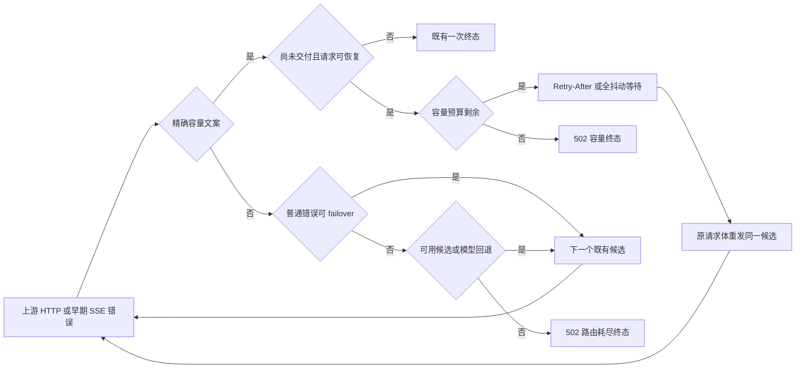

# 上游容量重试与耗尽终态设计

## Problem

容量重试按入口分叉：Aggregate API 两次全抖动重放，账号池一次立即重放，均忽略 `Retry-After`。更严重的是，容量预算耗尽和路由耗尽分支将 `429`、`503` 或 `404` 原样透传；外部客户端可再次提交请求，重复触发每次请求内有界的重试预算。

## Boundaries and Contract

- 保留 `is_selected_model_capacity_error` 的严格语义；错误正文解析完成后传递标准化匹配结果，禁止用泛化文本猜测容量。
- 在 `gateway/upstream/support/` 扩展既有退避/deadline 机制：优先合法且不超过约 2 秒的 `Retry-After`，否则复用全抖动；所有等待受 deadline 限制。
- 两条入口均为首次请求加两次**同候选**容量重放。`pending_failover_request` 是重放先决条件；已交付输出不可重放。
- 容量预算耗尽是专有终态原因：Aggregate API 不再把它包装为可模型回退的 `Unavailable`；账号池不再向客户端直透上游容量状态。两条路径都返回 `502`，且不冷却、不切换账号/候选/模型。
- 普通非容量失败维持现有候选 failover；仅在所有候选、账号或允许的模型回退均耗尽时，才在 `proxy.rs` 的终态分支归一化为 `502`。真正的客户端输入/鉴权/限额错误不参与归一化。
- 无匹配的 Aggregate API、cooldown/零余额造成的无候选和禁用路由，均是配置模型的路由不可用终态；在没有可继续的模型回退时统一为 `502`。`model_not_found` 仍保留现有客户端错误语义。
- 继续使用 `terminal_text_response`，不新增错误码或响应字段；5xx 已映射为 `server_error`。

## Data Flow

## Change Locations

- `gateway/upstream/support/`：唯一的容量等待决策与 `Retry-After` 解析。
- `protocol/aggregate_api.rs`：传入上游响应头；容量耗尽标记为专有 `502` 终态并阻止模型回退；无候选分支在最终路由耗尽时采用 `502`。
- `proxy_pipeline/candidate_executor.rs` 与 `response_finalize.rs`：账号池容量预算改为两次并经共享等待；预算耗尽返回 `502`，而不是上游原始状态。
- `upstream/proxy.rs`：只在所有常规候选/回退已经耗尽的终态分支执行路由不可用归一化；保留 4xx 和配额语义。

## Compatibility and Rollback

- 不改变模型选择、普通故障 failover、人工 API 状态、账户健康、客户端响应结构或数据库配置。
- `502` 的错误类型沿用 `terminal_text_response` 的 `server_error`；日志仍保留原始诊断以便排障。
- 无迁移、无新设置。回滚所涉服务文件即可恢复当前状态语义。
