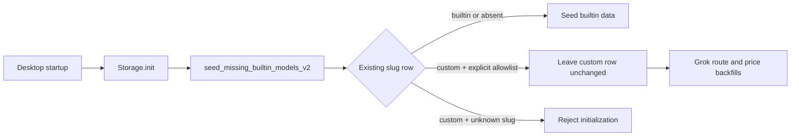

# Design: Restore built-in seed collision compatibility

## Context and current behavior

`Storage::init()` always calls `seed_missing_builtin_models_v2()` after schema setup. `seed_missing()` iterates the bundled model fixture and `insert_seed()` queries the row selected by case-insensitive slug. If that row is custom, only slugs in `TOLERATED_CUSTOM_SEED_COLLISIONS` return successfully; every other custom/builtin collision aborts initialization.

The current allowlist contains `gpt-image-2` and `gpt-6-astra`, but lost the existing `grok-4.5` entry during the Astra addition. The normal seed is therefore no longer idempotent for persisted custom Grok rows, and desktop startup fails before the app window opens.

## Proposed solution and boundary

Use the existing allowlist as the sole compatibility policy. Restore `grok-4.5` alongside the current `gpt-image-2` and `gpt-6-astra` entries in `crates/core/src/storage/model_catalog_v2.rs`.

No new migration is necessary. The failure is in the idempotent seed run performed on every startup, so the fixed binary will handle the already-persisted custom row on its next ordinary initialization. No database row is rewritten merely because it collides with a built-in seed.

## Invariants

- Slug matching remains case-insensitive.
- A tolerated collision returns before writing prices, tiers, default account-pool routes, or builtin metadata for that row.
- The custom row retains its identity, `origin`, user-edited state, price data, metadata, and routes.
- Grok-specific backfills continue after the tolerated seed collision and fill only missing fields; user-edited values remain intact.
- Unlisted custom/builtin collisions remain startup errors, preserving the existing data-integrity guard.
- `gpt-image-2` and `gpt-6-astra` retain their established compatibility behavior.

## Data flow

## Compatibility and rollback

Compatibility is restored for existing custom `grok-4.5` databases without a schema change. Reverting this code would reintroduce the deterministic startup block for those databases; no data rollback is required because the fix does not mutate those custom model records.

## Alternatives rejected

1. **Treat every custom collision as valid.** Rejected: it hides unintended ownership conflicts for future built-in models and removes the existing integrity boundary.
2. **Convert the custom Grok row to a builtin during migration.** Rejected: this destroys user ownership semantics and risks overwriting routes, metadata, and pricing.
3. **Create a one-off SQL migration.** Rejected: no stored schema/data change is needed; the current startup seed itself needs to tolerate the valid historical state.
4. **Catch the error in Tauri and continue startup.** Rejected: it would mask catalog initialization failures beyond this known compatibility case.

## Test design

Keep the existing custom-Grok seed/backfill test as the consumer-observable regression seam. It already proves: seeding succeeds, a custom Grok remains custom, required backfills occur, and a second seed preserves user changes. Extend the existing custom-Astra migration test to invoke normal seeding after the Astra migration, ensuring the shared allowlist protects both intended custom slugs at actual startup.
